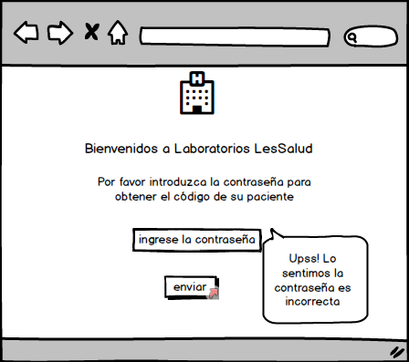
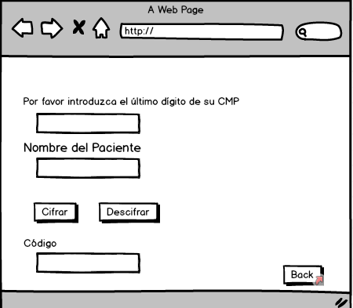

# Code results

## 1.Explicar quiénes son los usuarios y los objetivos en relación con el producto.
*Code Results* Es una plataforma que facilita a los médicos la lectura de resultados ( de análisis ) de sus pacientes online, mediante un código que se le brinda introduciendo algunos datos.
Primero van a ingresar con la contraseña del Laboratorio. Despues los va a dirigir a otra ventana donde deberán introducir el ultimo código de su CMP. El segundo dato que deberán introducir es el nombre del paciente . Por último deberán elegir cifrar o descifrar. Con ese código podrán acceder a la base de datos del Laboratorio y obtener los Resultados.

## 2.Explicar cómo el producto soluciona los problemas/necesidades de dichos usuarios.

Los usuarios (médicos) pueden acceder de una manera más rápida y personalizada a los datos de sus pacientes.
Muchas veces los Pacientes tienen que 

## 3.- Agregar un resumen del feedback recibido indicando las mejoras a realizar de su prototipo en papel

Mi primer prototipo en papel era dirigido a pacientes pero tenía varios problemas, me sugirieron que sea mejor para Doctores

En mi prototipo de Balsamiq el usuario no sabia donde ba el código ya que los botones de cifrar y descifrar estaban al ultimo.

## Prototipo en papel 

## Protoripo de baja fidelidad en Balsamiq

